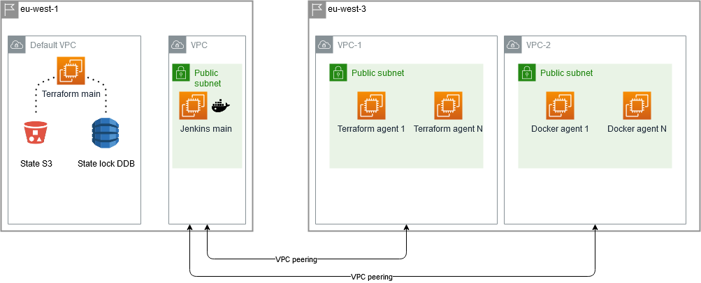

# tf-infra

## Summary

Idea was inspired by ACloudGuru course [Deploying to AWS with Terraform and Ansible](https://acloud.guru/learn/8a6f598f-a41f-48ff-99a6-2c7a760b4119?_ga=2.170516256.1013769593.1602746496-2124952926.1598614771).

Based on [repo](https://github.com/linuxacademy/content-deploying-to-aws-ansible-terraform) from the course but adjusted to my vision and using previously explored [dockerized Jenkins](https://github.com/IgorMishchuk/weissbeerger-docker).

### Draft scheme

# Work in progress..
